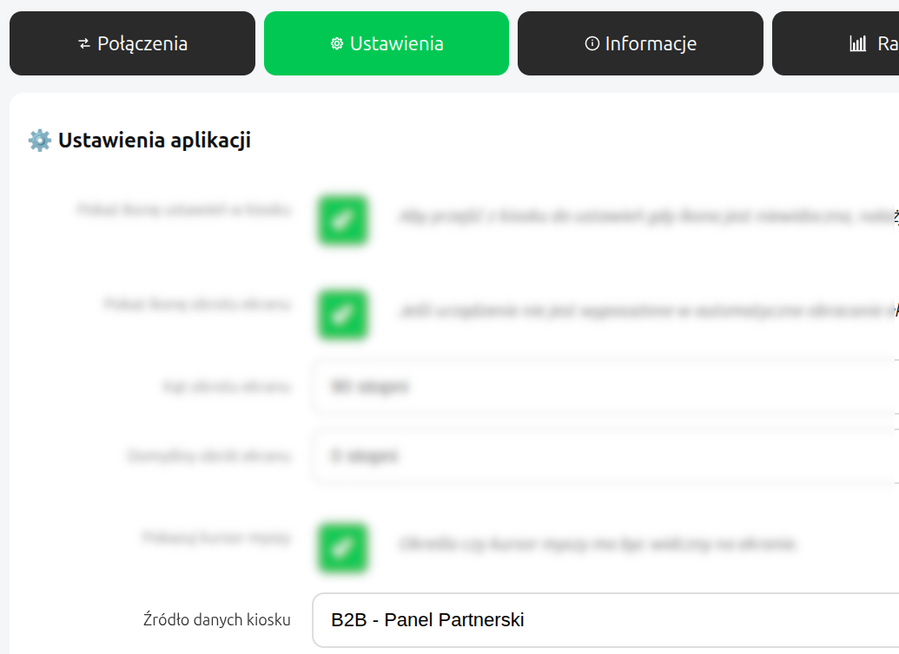
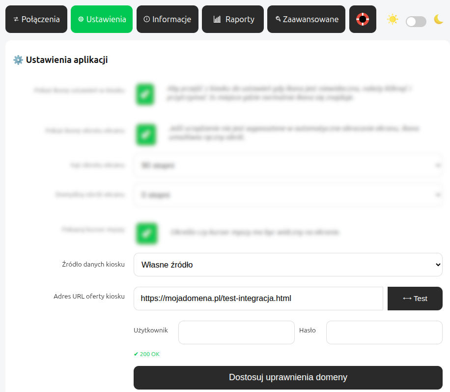

# 🖥️ Szablony Kiosków

Zestaw nowoczesnych, responsywnych szablonów UI do zastosowania w kioskach samoobsługowych Kiosk Zero, Kiosk Core, Kiosk Easy i Kiosk Pro. Zawarte w repozytorium materiały przeznaczone są do budowy interfejsu dla kiosków sprzedażowych, systemów sprzedazy POS, infomatów, automatów biletowych, systemów monitoringu itp.


## ✨ Funkcje

- 📐 Gotowe layouty pod ekrany dotykowe (FullHD / pion / poziom)
- 🧩 Modułowa struktura szablonów (łatwa personalizacja)
- 🎨 Możliwość brandingu (logo, kolory, czcionki)
- 🖼️ Obsługa ikon i grafik kategorii / produktów
- 🌐 Wielojęzyczność (i18n)
- ♿ Przyjazne dla dostępności (duże przyciski, kontrast, tryb high-contrast)
- ⚡ Lekkie i szybkie – zoptymalizowane pod stosowany w kioskach hardware

## 🚀 Jak używać
 - zmień style CSS, zmień układ wizualny, NIE ZMIENIAJ identyfikatorów obiektów (parametr "id"). Oprogramowanie kiosku na podstawie identyfikatorów uruchomi odpowiednie funkcje
 - szablon mozesz wgrać do swojego konta w panelu B2B: 👉 https://b2b.bigdotsoftware.eu lub wystawić w swojej domenie np.: 👉 https://mojadomena.pl/test-integracja.html lub 👉 https://bigdotsoftware.pl/test-integracja.html
 - Jeśli wgrasz szablon do swojego konta w panelu B2B: 👉 https://b2b.bigdotsoftware.eu, wówczas w ustawieniach kiosku ustaw "Źródło danych kiosku" na "B2B Panel Partnerski". Kiosk automatycznie zsychnronizuje się z Twoim kontem B2B i wczyta wgrany szablon. 
 - Jeśli wystawisz szablon w swojej domenie, wówczas w ustawieniach kiosku ustaw "Źródło danych kiosku" na "Własne źródło". 
 
 Jeśli chcesz zbudować własny interfejs, a aktualny model szablonów nie daje takiej możliwości lub wymaga modyfikacji zachowania, skontaktuj się z nami. 
  
 Alternatywnie możesz pominąć ładowanie pliku kiosk.js, stworzyć własny kod korzystający z backendu Kiosku.


## 📦 Tutorial

Ten krótki tutorial pokazuje, jak krok po kroku rozwijać własne szablony w prostym flow kiosku – od automatycznego dodania produktu aż po pełną obsługę zamówienia i płatności.

### 🧩 Krok 1: Dodawanie produktu

Za pomocą metody:

```js
kiosk.addToCart(product);
```

produkt zostaje dodany do koszyka. Następnie system automatycznie rozpoczyna proces zamówienia, płatności oraz wydruku.

Przykładowy przycisk inicjujący:

```html
<button id="orderNowBtn">Zapłać</button>
```

Konieczne jest również wczytanie SDK kiosku:

```html
<script src="/kiosk.js" defer></script>
```

### 🧩 Krok 2: Pasek koszyka

Dodaj element:

```html
<div id="cartBar"></div>
```

Element ten automatycznie wyświetla podsumowanie koszyka.


### 🧩 Krok 3: Widok zamówienia

Dodaj kontener:

```html
<div id="orderList" class="hidden"></div>
```

Służy on do prezentowania podsumowania koszyka. Zawiera trzy przyciski:

```html
<button id="backBtn">⬅ Produkty</button>
<button id="payNowBtn">Zapłać</button>
<button id="orderNowBtn">Zamów</button>
```

- **⬅ Produkty** – powrót do listy produktów  
- **Zapłać** – przejście do płatności  
- **Zamów** – SDK kiosku zadba o to aby był widoczny tylko wtedy, gdy kiosk nie posiada dostępnych metod płatności  


### 🧩 Krok 4: Modale informacyjne

Dodaj dwa elementy:

```html
<div id="infoModal" class="hidden"></div>
<div id="resultModal" class="hidden"></div>
```

- `infoModal` – wyświetla informacje i błędy  
- `resultModal` – prezentuje wynik zamówienia  

Jeśli wczytane zostanie SDK do obsługi kodów QR, w `resultModal` automatycznie pojawi się wygenerowany kod QR.


## 📜 Licencja

MIT – możesz używać komercyjnie, modyfikować i dystrybuować.

## 📬 Kontakt

Jeśli tworzysz swój własny szablon kiosku, skontaktuj się z nami - pomożemy Ci to zrobić szybko i efektywnie.

https://bigdotsoftware.pl/
bigdotsoftware@bigdotsoftware.pl
